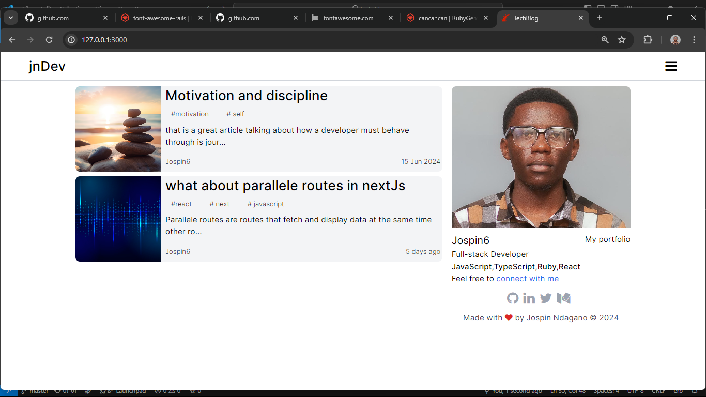
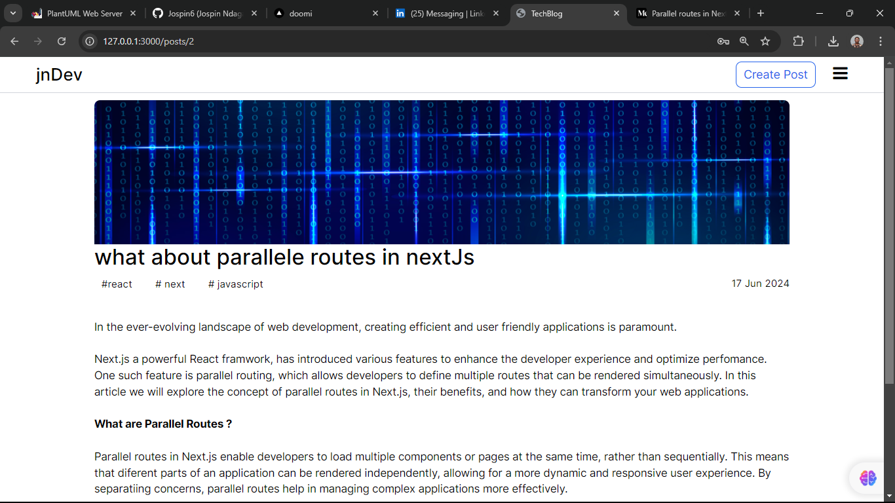
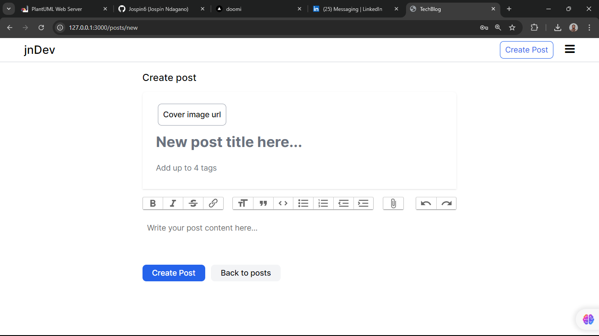

# jnDev Blog
##  This project is a blog application built with Ruby on Rails.
### The application is a blog where i post my knowledge in different tech domains.

> The home page is a list of all my posts and a section that introduce myself.

> The single post page allow visitors to read more about a post that catch their attention.

> The create post page is a form usign Action text.

## Built With

- Ruby
- Ruby on Rails
- Tailwindcss
- PostgreSQL
- Render

## Live Demo

[Live Demo Link](https://tech-blog-rwnb.onrender.com/)

## Getting Started

Here are the steps to follow in order to get this project on your local computer.

### Prerequisites

`Ruby 3.2.2`

`Rails 7`

### Setup

clone this repo by typing `git clone`

### Install

install the dependacies by typing `bundle install`

### Usage

start the local server by running `rails server`

### Deployment

this project is deployed on Render

### Testing

this project uses RSpec and Capybara for testing 

## Authors

👤 **Jospin Ndaano**

- Github: [@Jospin6](https://github.com/Jospin6)
- Linkedin: [@Jospin](https://www.linkedin.com/in/jospin-ndagano-8474b7267/)

## 🤝 Contributing

Contributions, issues and feature requests are welcome!

Feel free to check the [issues page](issues/).

## Show your support

Give a ⭐️ if you like this project!

## Acknowledgments

- Hat tip to anyone whose code was used
- Inspiration

## 📝 License

This project is [MIT](lic.url) licensed

